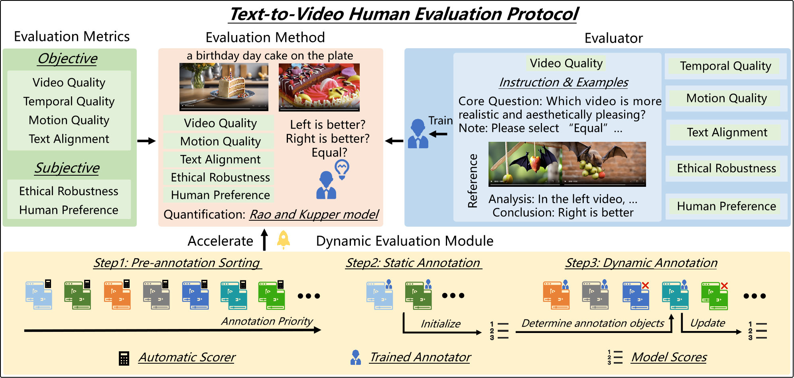

# T2VHE

Official implementation of ["Rethinking Human Evaluation Protocol for Text-to-Video Models: Enhancing Reliability, Reproducibility, and Practicality"](https://arxiv.org/abs/2402.05011).

The overall framework of the proposed T2VHE:



The annotation interface with the dynamic evaluation algorithm can be run directly with the following command

```
python app.py
```

We also provide HTML for static annotation tasks written based on AMT platform requirements.
